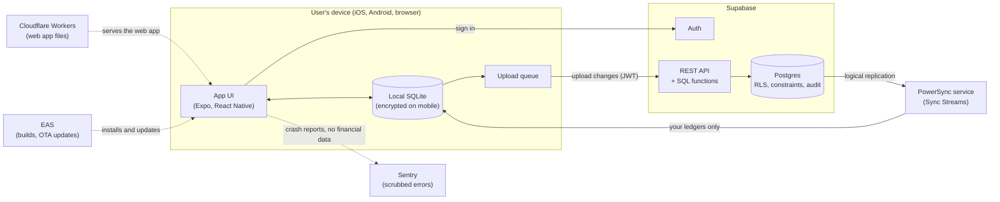
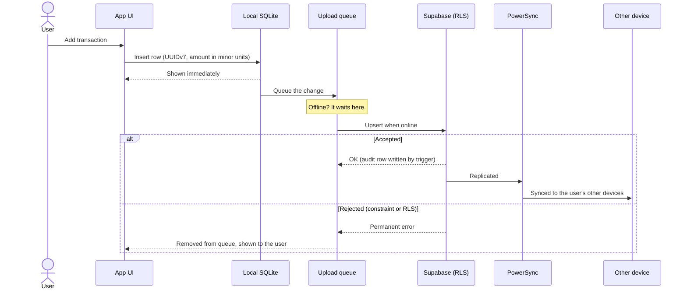

# Architecture

How spend-tracker fits together, how data moves, and what we defend against. The decisions behind this design are in [`docs/adr/`](adr/), and the rules that keep it true are in [`docs/engineering-standards.md`](engineering-standards.md).

> **Status:** target architecture. The repository foundation exists; the app and backend are built in Phase 1.

## System context

| Component                     | Responsibility                                                      | Decision                                                                                                       |
| ----------------------------- | ------------------------------------------------------------------- | -------------------------------------------------------------------------------------------------------------- |
| App UI                        | Screens and forms; reads and writes only the local database         | [ADR-0003](adr/0003-expo-universal-client.md)                                                                  |
| Local SQLite                  | The working copy of the user's ledgers; works offline               | [ADR-0004](adr/0004-local-first-powersync-supabase.md), [ADR-0010](adr/0010-device-encryption-and-app-lock.md) |
| Upload queue                  | Holds local changes until the server accepts or rejects them        | [ADR-0008](adr/0008-write-path-and-conflicts.md)                                                               |
| Supabase Auth                 | Sign-in, sessions, two-factor authentication                        | [ADR-0009](adr/0009-authentication-and-sessions.md)                                                            |
| Supabase REST + SQL functions | Applies uploads; multi-row operations run atomically                | [ADR-0008](adr/0008-write-path-and-conflicts.md)                                                               |
| Postgres                      | The source of truth: constraints, Row Level Security, the audit log | [ADR-0005](adr/0005-ledger-tenancy-and-rls.md), [ADR-0006](adr/0006-money-and-currency.md)                     |
| PowerSync                     | Streams each user's ledgers to their devices                        | [ADR-0004](adr/0004-local-first-powersync-supabase.md)                                                         |
| Cloudflare, EAS, Sentry       | Hosting, mobile delivery, error reports                             | [ADR-0011](adr/0011-environments-and-deploy-order.md), [ADR-0012](adr/0012-telemetry-and-privacy.md)           |

## Key flows

### Adding a transaction (works offline)

### Reading data

Screens query the local SQLite database with indexed queries ([PERF1](engineering-standards.md#7-performance-perf)). The network is never on the render path, so screens are equally fast offline.

## Trust boundaries

1. **Device and server.** Everything arriving from a device is untrusted. RLS, constraints and SQL functions decide what is accepted ([ARC6](engineering-standards.md#3-architecture-arc)).
2. **Ledger and ledger.** A member of one ledger must never read or write another ledger's data, whether through the API or through sync ([ADR-0005](adr/0005-ledger-tenancy-and-rls.md)).
3. **CI and the cloud.** Deploy credentials exist only in protected GitHub Environments. Production needs the maintainer's approval.
4. **Contributors and the repository.** Code from forks runs without secrets, and workflows from outside contributors need approval before they run.
5. **Dependencies and the build.** Third-party packages and actions are pinned, aged at least 3 days, and license-checked.

## Threat model

**Assets:**

- financial data (amounts, payees, notes, balances);
- account credentials and session tokens;
- deploy credentials and signing keys;
- the sync service's database password, which can read every change in the database;
- the integrity of the code and releases.

**Actors:**

- another user, including a member of a different ledger;
- someone with a stolen or shared device;
- a network attacker;
- a malicious contributor;
- a compromised dependency or GitHub Action;
- the project's own mistakes.

| Threat (STRIDE)                                                         | Example                                                                      | Mitigation                                                                                                                                                                                                                                            | Rules                   |
| ----------------------------------------------------------------------- | ---------------------------------------------------------------------------- | ----------------------------------------------------------------------------------------------------------------------------------------------------------------------------------------------------------------------------------------------------- | ----------------------- |
| **Spoofing:** someone else signs in as the user                         | Guessing a one-time code, a stolen session                                   | Supabase Auth rate limits, optional TOTP, sessions in SecureStore, wiped on sign-out                                                                                                                                                                  | SEC4                    |
| **Tampering:** a device uploads invalid or hostile data                 | A modified client writes to another ledger or breaks invariants              | RLS on every table, constraints, SQL functions for multi-row operations, validation at every boundary                                                                                                                                                 | SEC1, SEC2, SEC7, DATA5 |
| **Tampering:** malicious code reaches `main` or a release               | A compromised package or action, an unreviewed change                        | Pinned SHAs, a 3-day minimum release age, dependency review, CodeQL, signed commits, PRs required                                                                                                                                                     | SEC8, SEC9, GIT3        |
| **Repudiation:** "I didn't change that"                                 | Disputed edits in a shared ledger                                            | Server-side audit log written by triggers that clients can't touch                                                                                                                                                                                    | DATA7                   |
| **Information disclosure:** another ledger's data leaks                 | A missing RLS policy, a sync rule that's too broad                           | Default-deny RLS with tests for every policy, membership-scoped Sync Streams                                                                                                                                                                          | SEC1, SYNC6             |
| **Information disclosure:** data leaks from a device or from telemetry  | A lost phone, crash reports, logs                                            | Encrypted local database, app lock, scrubbed telemetry, logger that drops financial data                                                                                                                                                              | SEC5, CON6, ADR-0012    |
| **Information disclosure:** secrets leak                                | A token committed or printed in CI logs                                      | Secret scanning with push protection, secrets only in Environments and EAS, never in code or chat                                                                                                                                                     | SEC3, SEC9              |
| **Information disclosure:** the sync service's database password leaks  | The replication password is pasted into a log, chat or the SQL editor        | The role can't sign in until an operator enables it in each environment. The password lives only in the password manager and PowerSync, and is set with `\password` so the server never sees it in plain text ([runbook](operations/sync-service.md)) | SEC3                    |
| **Denial of service:** one bad change blocks syncing                    | A rejected upload stuck at the head of the queue                             | Permanent errors leave the queue and are shown to the user                                                                                                                                                                                            | SYNC3                   |
| **Elevation of privilege:** a viewer edits, or a function runs as owner | Weak role checks, a `security definer` function with a mutable `search_path` | Role-aware policies with tests, hardened `security definer` functions                                                                                                                                                                                 | SEC1, SEC2              |
| **Elevation of privilege:** AI-agent instructions are hijacked          | A dependency rewrites `AGENTS.md`                                            | Agent-instruction files are reviewed like code, and tools are blocked from writing them                                                                                                                                                               | SEC10                   |

### Known risks we accept for now

- **Beta components:** PowerSync's React Native Web support and the encrypted SQLite adapter. The walking skeleton tests them first, and each has a documented fallback ([ADR-0003](adr/0003-expo-universal-client.md), [ADR-0010](adr/0010-device-encryption-and-app-lock.md)).
- **Last write wins** can overwrite a concurrent edit to the same row. The audit log keeps the overwritten value ([ADR-0008](adr/0008-write-path-and-conflicts.md)).
- **Free tiers** have no backups and pause when idle. Real data waits until encrypted backups exist ([launch checklist](operations/launch-checklist.md)).

Revisit this threat model before inviting other users (Phase 4) and after any incident.
